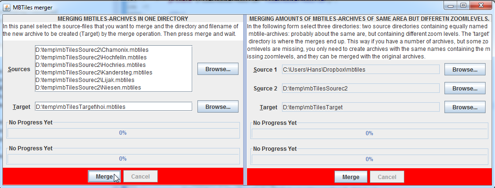

MBTilesProcessor
================

Java Utility to process mbtiles: first uility: merge mb tiles archives
This project is about processing mbtile archives. It can currently merge mbtiles-archives and it has a GUI. I needed to merge a lot of MBTile archives and found nothing that I could get to work (except https://github.com/mapbox/node-mbtiles, but I couldn't get the nodes js to work and I quit in frustration, deciding to make some myself that is easier to use...
An executable jar file of this application can be downloaded from https://dl.dropbox.com/s/gswbjmep7bgme87/MbTilesProcessor.jar
